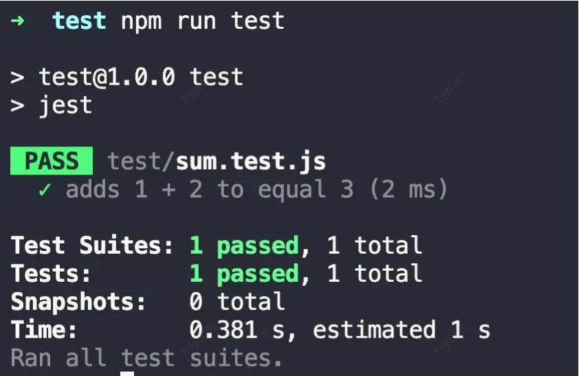

# 单元测试

单元测试允许你将独立单元的代码进行隔离测试，其目的是为开发者提供对代码的信心。通过编写细致且有意义的测试，你能够有信心在构建新特性或重构已有代码的同时，保持应用的功能和稳定。

## 选择框架

因为单元测试的建议通常是框架无关的，所以下面只是当你在评估应用的单元测试工具时需要的一些基本指引。

### Jest

Jest 是一个专注于简易性的 JavaScript 测试框架。一个其独特的功能是可以为测试生成快照 (snapshot)，以提供另一种验证应用单元的方法。

[Jest 官网](https://jestjs.io/zh-Hans/)

### Mocha

Mocha 是一个专注于灵活性的 JavaScript 测试框架。因为其灵活性，它允许你选择不同的库来满足诸如侦听 (如 Sinon) 和断言 (如 Chai) 等其它常见的功能。另一个 Mocha 独特的功能是它不止可以在 Node.js 里运行测试，还可以在浏览器里运行测试。

[Mocha 官网](https://mochajs.org/)

## 框架对比

|  框架   | 断言  |  异步   | 代码覆盖率  |
|  ----  | ----  |  ----  | ----  |
| Mocha  | 不支持（需要其他库支持） | 友好  | 不支持（需要其他库支持） |
| Jest  | 默认支持 | 友好  | 支持 |

- Mocha 生态好，但是需要较多的配置来实现高扩展性
- Jest 开箱即用

### 由于Element-plus和Vant都使用Jest，所以这里我们选择Jest作为测试框架

## Jest 的基本使用

### 1.安装依赖
```
npm install --save-dev jest
```

### 2.简单的例子

首先，创建一个 sum.js 文件

```javascript
function sum(a, b) {
  return a + b;
}
 
module.exports = sum;
```

创建一个名为 sum.test.js 的文件，这个文件包含了实际测试内容：

./test/sum.test.js

```javascript
const sum = require('../sum');
 
test('adds 1 + 2 to equal 3', () => {
  expect(sum(1, 2)).toBe(3);
});
```

将下面的配置部分添加到你的 package.json 里面

```javascript
{
  "scripts": {
    "test": "jest"
  },
}
```

运行 npm run test ，jest 将打印下面这个消息



### 3.不支持部分 ES6 语法

nodejs 采用的是 CommonJS 的模块化规范，使用 require 引入模块；而 import 是 ES6 的模块化规范关键字。想要使用 import，必须引入 babel 转义支持，通过 babel 进行编译，使其变成 node 的模块化代码

**安装依赖**

```
npm install --save-dev babel-jest @babel/core @babel/preset-env
```

在项目的根目录下创建 babel.config.js ，通过配置 Babel 使其能够兼容当前的 Node 版本。

```javascript
// babel.config.js
module.exports = {
  presets: [['@babel/preset-env', {targets: {node: 'current'}}]],
};
```

## 使用 Typescript

**通过 babel 来支持 Typescript**

通过 Babel，Jest 能够支持 Typescript。首先要确保你遵循了上述 使用 Babel 指引。接下来安装 @babel/preset-typescript 插件：

```
npm install --save-dev @babel/preset-typescript
```
然后将 @babel/preset-typescript 添加到 babel.config.js 中的 presets 列表中。

```javascript
module.exports = {
  presets: [
    ['@babel/preset-env', {targets: {node: 'current'}}],
    '@babel/preset-typescript', // add
  ],
};
```

不过，将 TypeScript 和 Babel 一起使用时有一些 注意事项 。由于 Babel 对 Typescript 的支持是通过代码转换（Transpilation）实现的，而 Jest 在运行时并不会对你的测试用例做类型检查。 如果你需要此功能，可以使用 ts-jest ，或者单独（或作为构建流程的一部分）直接运行 TypeScript 编译器 tsc 。

### 使用 ts-jest

ts-jest is a TypeScript preprocessor with source map support for Jest that lets you use Jest to test projects written in TypeScript.

@types/jest provide full typing when writing your tests with TypeScript.

```
npm install --save-dev ts-jest @types/jest
```